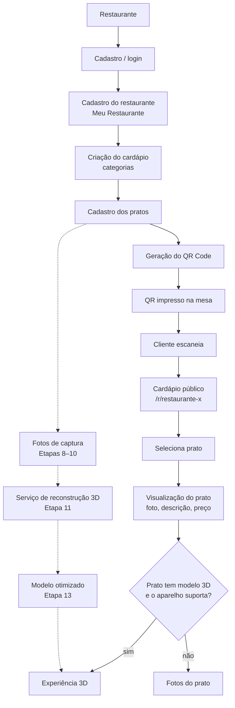
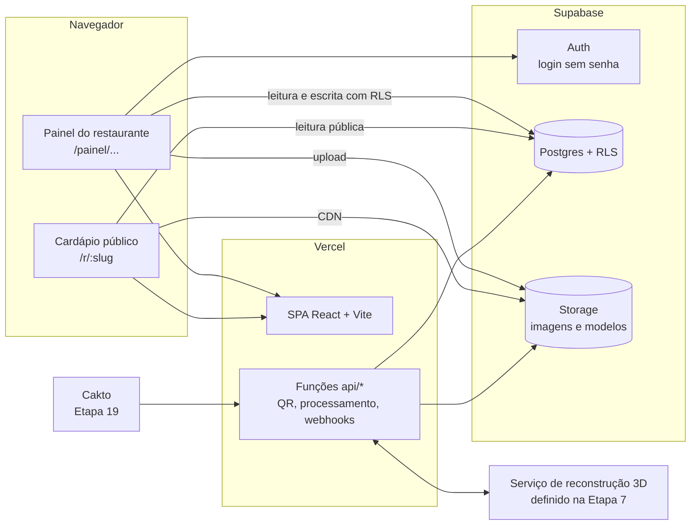
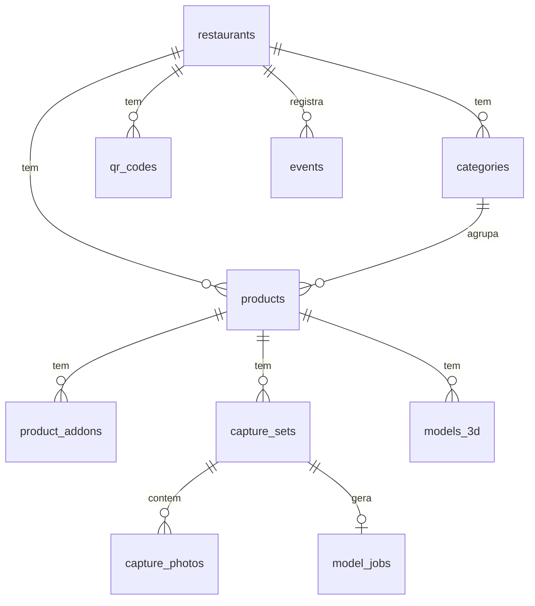
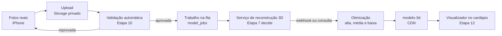

# Cardápio 3D: arquitetura geral (Etapa 1)

Este documento registra a análise do projeto atual e a arquitetura proposta para o Cardápio 3D.
Nenhuma funcionalidade do cardápio foi implementada nesta etapa.

---

## 1. Análise do projeto atual

### 1.1 O que é o repositório hoje
O repositório `PaginaPrincipal` contém o **PromptForge**, um produto que não tem relação com cardápios.
Ele gera prompts para IA, prospecta comércios no mapa, tem um funil de contatos (mini CRM) e vende
acesso pago pela Cakto.

**Conclusão:** do Cardápio 3D ainda não existe nada: nenhuma tabela, tela ou rota.
O que pode ser aproveitado é a **stack** e alguns **padrões já testados**.

### 1.2 Tecnologia utilizada

| Camada | Tecnologia | Observação |
|---|---|---|
| Front-end | React 19 + TypeScript + Vite 8 | SPA (aplicação de página única) |
| Navegação | Estado interno + `#hash` (`#entrar`, `#termos`) | **Não há roteador.** Não suporta URLs como `/r/restaurante-x` |
| Estilo | CSS puro (`src/styles.css`) | Sem biblioteca de componentes |
| Back-end | Funções serverless da Vercel (`api/*.ts`) | Padrão Web `Request`/`Response` |
| Banco | Supabase (Postgres) com RLS | `supabase/schema.sql` |
| Autenticação | Supabase Auth, login sem senha (link mágico + código de 6 dígitos) | `src/auth/useAccess.ts`, `server/auth.ts` |
| Pagamento | Cakto via webhook | `api/cakto-webhook.ts`, `server/cakto.ts` |
| Testes | Vitest | Só lógica pura (sem testes de tela) |
| Publicação | Vercel | Não há `vercel.json` |

### 1.3 Estrutura de pastas
```
api/        funções serverless (webhook Cakto, busca de lugares, diagnóstico /api/status)
server/     regras do servidor (decisão de acesso, Google Places, OpenStreetMap, autenticação)
src/
  auth/     sessão + acesso pago
  lib/      regras puras e testadas (acesso, config, CRM, prompt...)
  screens/  telas (Landing, Login, Prospect, Contacts, Questionnaire, Result...)
  components/, data/, config/, legal/, crm/
supabase/   schema.sql (tabelas e políticas de segurança)
docs/       MVP.md, CONFIGURACAO.md
```

### 1.4 Banco de dados (existente)

| Tabela | Uso | Segurança |
|---|---|---|
| `access` | Quem pagou (chave = e-mail) | Cada usuário só lê o próprio registro; só o webhook escreve |
| `webhook_events` | Registro dos avisos da Cakto | Sem acesso pelo site |
| `saved_leads` | Funil de contatos | Cada usuário só vê e edita os próprios (`user_id = auth.uid()`) |

Não há **Supabase Storage** (armazenamento de arquivos) em uso. O Cardápio 3D vai precisar dele
para logos, capas, fotos dos pratos, fotos de captura e modelos 3D.

### 1.5 Autenticação
- Login sem senha pelo Supabase (e-mail, link mágico ou código).
- O acesso pago é verificado pela tabela `access` (`hasActiveAccess`).
- No servidor, `requireAccess()` valida o token `Authorization: Bearer` e o acesso pago.
- A RLS (segurança por linha) já é o padrão do projeto. É exatamente o modelo que o Cardápio 3D precisa
  para isolar os restaurantes.

### 1.6 APIs e variáveis de ambiente

| Endpoint | Função |
|---|---|
| `POST /api/cakto-webhook` | Libera, mantém ou remove acesso conforme o evento da Cakto |
| `POST /api/places-search` | Busca comércios (Google ou OpenStreetMap) |
| `POST /api/places-details` | Atualiza os dados dos comércios salvos |
| `GET /api/status` | Diagnóstico da configuração (não mostra valores) |

Variáveis (`.env.example`): `VITE_SUPABASE_URL`, `VITE_SUPABASE_ANON_KEY`, `SUPABASE_URL`,
`SUPABASE_SERVICE_ROLE_KEY`, `CAKTO_WEBHOOK_SECRET`, `CAKTO_LIFETIME_IDS`, `CAKTO_MONTHLY_IDS`,
`VITE_GOOGLE_MAPS_*`, `GOOGLE_PLACES_API_KEY`, `VITE_MAP_TILE_*`, `OVERPASS_URL`, `VITE_DEMO_MODE`.

### 1.7 O que está funcionando (verificado nesta etapa)
- `npm ci`: dependências instaladas sem erro.
- `npm test`: **52 testes passando** em 9 arquivos.
- `npm run build`: gera `dist/` sem erro. Há um aviso de que o pacote JS tem 680 kB (197 kB comprimido);
  não é erro, mas mostra que falta dividir o código em partes.
- Não foi possível testar o login, o banco e o webhook reais: dependem das chaves do Supabase e da Cakto,
  que não estão neste ambiente.

### 1.8 O que aproveitar e o que falta

| Aproveitar | Falta criar |
|---|---|
| Stack React + TS + Vite + Supabase + Vercel | Roteador com URLs reais (`/r/:slug`, `/painel/...`) |
| Login sem senha do Supabase | Modelo de dados do restaurante e do cardápio |
| Padrão de RLS por dono | Supabase Storage (imagens e modelos) |
| Padrão de funções `api/` + `server/` com testes | Rewrites da Vercel para as rotas da SPA |
| Webhook Cakto (Etapa 19) | Fila de processamento 3D (Etapas 9–11) |
| `/api/status` para diagnóstico | Registro de eventos para as métricas (Etapa 16) |

---

## 2. Decisão importante: onde o Cardápio 3D vai morar

| Opção | Prós | Contras |
|---|---|---|
| **A. Repositório novo** (recomendado) | Produto, domínio, banco e deploy separados; nada do PromptForge quebra | Copiar os padrões úteis (login, config, webhook) |
| B. Dentro deste repositório | Reaproveita o código direto | Mistura dois produtos, dois públicos e dois bancos; o `App.tsx` atual não tem roteador |

**Recomendação:** repositório novo, com um **projeto Supabase novo**, começando na Etapa 2.
Este documento fica aqui até essa decisão ser tomada e depois é movido para o repositório novo.

---

## 3. Fluxograma geral do produto



As linhas tracejadas representam o fluxo 3D. Ele fica só **planejado** até a Etapa 7.

---

## 4. Arquitetura do sistema



### 4.1 Princípios
1. **Isolamento por restaurante desde o primeiro dia.** Toda tabela tem `restaurant_id`, e a RLS só
   libera os dados para o dono. A Etapa 17 (SaaS) vira configuração, não reescrita. Isso não antecipa
   funcionalidades: é só a forma de modelar os dados.
2. **Cardápio público só leitura**, sem login, e só com o que estiver publicado e disponível.
3. **Tudo que é pesado fica fora do navegador do dono e da função da Vercel.** Os uploads vão direto
   para o Storage, e a reconstrução 3D acontece num serviço externo, com uma fila de trabalhos.
4. **Carregamento rápido no celular.** O cardápio público precisa abrir rápido em 4G, e o código do 3D
   só é carregado quando o cliente pede (carregamento sob demanda).

### 4.2 Rotas previstas

| Rota | Quem acessa | Etapa |
|---|---|---|
| `/entrar` | Dono do restaurante | 2 |
| `/painel/restaurante` (Meu Restaurante) | Dono | 2 |
| `/painel/cardapio` | Dono | 3 |
| `/r/:slug` | Cliente (público) | 4 |
| `/r/:slug/p/:produto` | Cliente | 4 / 6 |
| `/painel/qrcode` | Dono | 5 |
| `/painel/como-fotografar` | Dono | 8 |
| `/painel/modelos-3d` | Dono | 9–14 |
| `/painel` (dashboard) | Dono | 16 |

A navegação atual por `#hash` não serve para isso. Será preciso um roteador (ex.: React Router)
e uma regra de rewrite na Vercel que envie todas as rotas para o `index.html`.

### 4.3 Modelo de dados previsto
A tabela abaixo é só o desenho. Cada tabela será criada **na sua própria etapa**.



| Tabela | Principais campos | Etapa |
|---|---|---|
| `restaurants` | `owner_id`, `slug` (único), nome, nome comercial, logo, capa, endereço, telefone, WhatsApp, Instagram, horários (JSON), descrição, cores | 2 |
| `categories` | `restaurant_id`, nome, ordem | 3 |
| `products` | `restaurant_id`, `category_id`, nome, descrição, preço (em centavos), imagem, ingredientes, observações, disponível, ordem | 3 |
| `product_addons` | `product_id`, nome, preço | 3 |
| `qr_codes` | `restaurant_id`, token, criado em, ativo | 5 |
| `capture_sets` / `capture_photos` | fotos enviadas e resultado da validação | 9–10 |
| `model_jobs` | status do processamento (enviado, processando, pronto, erro) e id no serviço externo | 11 |
| `models_3d` | `product_id`, arquivo por qualidade (alta, média, baixa), tamanho, ativo | 11–14 |
| `events` | tipo (visita, visita pelo QR, prato aberto, 3D aberto), data, restaurante, prato | 16 |

### 4.4 Armazenamento (Supabase Storage)

| Bucket | Conteúdo | Acesso |
|---|---|---|
| `restaurant-media` | Logo e capa | Leitura pública, escrita só do dono |
| `product-images` | Fotos tradicionais dos pratos | Leitura pública, escrita só do dono |
| `capture-photos` | Fotos para reconstrução 3D | **Privado** |
| `models-3d` | Modelos finais otimizados | Leitura pública |

Caminho padrão dos arquivos: `{restaurant_id}/...`. Assim, as regras de segurança do Storage
conferem o dono pelo primeiro trecho do caminho.

### 4.5 Pipeline 3D (visão geral, sem decisão técnica)



A técnica (fotogrametria, NeRF ou Gaussian Splatting), o serviço, o formato final e o visualizador
**ficam em aberto de propósito** até a Etapa 7.

### 4.6 Variáveis de ambiente previstas
Mesmos nomes do Supabase já usados (`VITE_SUPABASE_URL`, `VITE_SUPABASE_ANON_KEY`, `SUPABASE_URL`,
`SUPABASE_SERVICE_ROLE_KEY`), mais `VITE_PUBLIC_SITE_URL` (base da URL gravada no QR Code, Etapa 5).
As chaves do serviço 3D e da Cakto entram só nas etapas correspondentes.

---

## 5. Pontos que precisam de decisão
1. **Repositório:** novo (recomendado) ou este. Veja a seção 2.
2. **Domínio:** qual endereço vai no QR Code (ex.: `seudominio.com/r/...`). Enquanto não houver domínio,
   dá para usar o endereço da Vercel. Mas trocar de domínio depois invalida os QR Codes já impressos.
   Por isso, o ideal é definir o domínio antes da Etapa 5.
3. **Um restaurante por conta** no início (várias unidades por conta fica para depois da Etapa 17).

## 6. Riscos identificados
- **Reconstrução 3D de comida** (brilho, molhos, transparência, derretimento) é o maior risco técnico
  do produto e será estudada na Etapa 7.
- **Tamanho dos modelos no celular:** o limite de tempo de abertura precisa ser definido e medido (Etapas 12–13).
- **QR Code impresso é permanente:** o slug e o domínio não podem mudar sem um redirecionamento.
